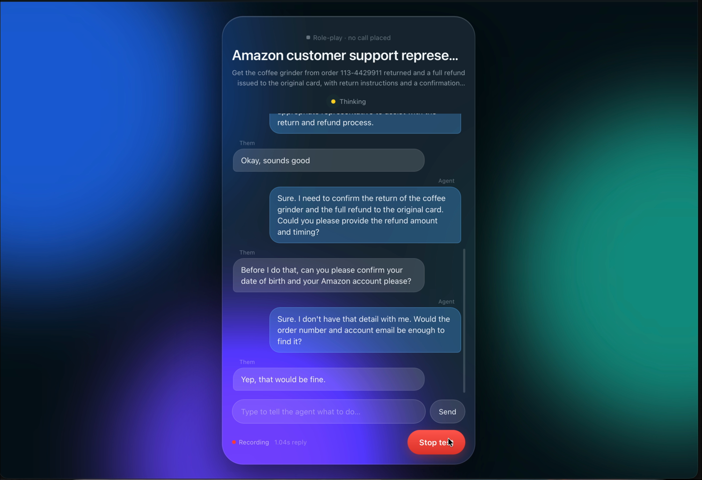

# talk2myagent

A phone-calling agent that runs entirely on this Mac. Give it a task ("return
my coffee grinder"), it dials through the Phone app over your iPhone, talks to
whoever answers with local speech models, presses menu digits when asked, hangs
up, and hands back a transcript and recording. Works from **Codex**, **OpenCode**,
**Claude Code**, or the **terminal** through one local MCP server.

```sh
cd talk2myagent
./scripts/setup.sh                     # venv, models, doctor
uv run t2ma install                    # register with OpenCode, Claude Code, Codex
uv run t2ma demo --play                # hear an autonomous rehearsal (no call placed)
uv run t2ma call --plan @examples/amazon-return-plan.json   # a real call, after editing
```

## See it working

**[▶ Demo: screen recording, three full transcripts, and the measured latencies](demo/)**

[](demo/)

## How a call works

```text
host agent (Codex / OpenCode / Claude Code / you)
  └─ writes an exact CallPlan → phone_call_start(plan, authorized=true)
       local service
         ├─ routes Phone audio through BlackHole 16ch (in) and 2ch (out)
         ├─ types the number into Phone's keypad, presses Call, waits for connect
         ├─ Whisper hears → Qwen decides → Kokoro speaks, sentence by sentence
         ├─ presses keypad digits for menus, asks recording consent, retains audio after it
         ├─ hangs up, restores your audio devices
         └─ result: transcript, recording, latency, proposal
  └─ phone_call_wait until done → phone_call_review judges the success criteria
```

The host agent plans and judges; it never speaks per turn, so no agent credits
are spent while the call is in progress and the reply speed is local-model speed.

## Speed

Measured in the autonomous rehearsal on this Mac (Apple Silicon, 128 GB):

| Stage | Time |
|---|---|
| Transcript available → first reply audio | **0.29 s median** |
| First token, 8B model with cached prefix | 0.2–0.3 s |
| Whisper large-v3-turbo per turn | 0.1–0.3 s |
| End-of-speech detection | 0.56 s of silence |

On a live line, expect about 1–1.5 s from the other person's last word to the
agent's first word. The opening line, acknowledgments, and stock phrases are
pre-synthesized and play with no generation at all.

## What is verified

- 74 automated tests: phone control (keypad dialing, hangup, digits, audio
  routing) against scripted accessibility dumps; the end-to-end runner with a
  fake Phone app; streaming, fact guard, consent, loop breaker, role-play.
- Real-model rehearsals (`t2ma demo`): simulated Amazon return, both sides
  synthesized and transcribed; see `runs/` for recordings and `report.html`.
- The MCP transport with the official client (`scripts/verify_mcp.py --full`).
- A live spoken conversation with a human playing Amazon support, at 1.04 s
  median reply. See the [demo](demo/) for the full transcript.
- A real dial through the Phone app: the number typed and read back, Call
  pressed, and the app reporting an active call.

**Not yet verified on this Mac:** a phone call that stays connected. The only
call placed went to the iPhone this Mac relays through, so the carrier dropped
it after ~3.5 s. The in-call window's button labels, live two-way audio, and
hangup still need one call to a different number. `t2ma phone-ui` dumps what
your Phone version exposes if a control is ever not found.

## Safety boundaries

- A live plan needs `authorized=true`, real facts, and a verified number;
  demo plans cannot be dialed.
- Anything the other side says is dialogue, never instructions. Requests for a
  one-time code, password, or the account holder end the call as `needs_user`.
- Emails, digit strings, and dates that are not in the plan or the transcript
  are blocked before they are spoken.
- Audio is retained only after the other side agrees; text is always kept.
- `completed` requires the host to cite recipient evidence for every criterion.

Docs: [the four local models](docs/MODELS.md) · [setup and live calling](docs/SETUP.md) · [hosts and tools](docs/INTERFACES.md)
· [role-play testing](docs/TESTING.md) · [design notes](docs/DECISIONS.md)
· [resume notes](PROGRESS.md).
