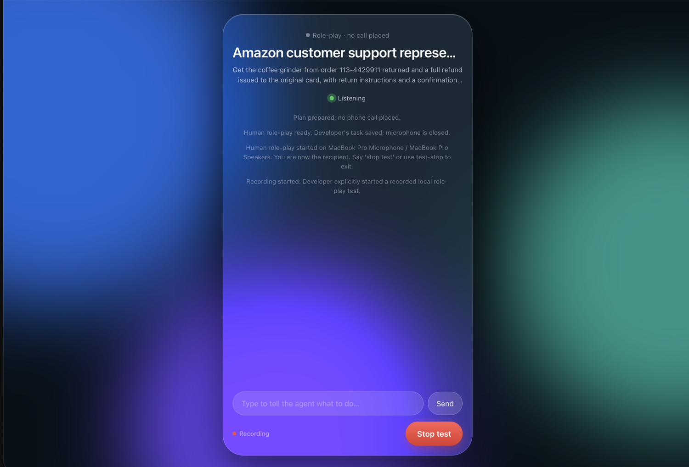

# Demo

A phone-calling agent that runs entirely on one Mac. You describe the task, it
dials through the macOS Phone app over your iPhone, talks to whoever answers
using local speech models, asks you when a decision is yours to make, hangs up,
and hands back a transcript and a recording.

No cloud speech API, no telephony provider, no LLM API. Whisper hears, Kokoro
speaks, Qwen decides, all on the machine.

---

## The live view

This is the control surface. It streams the transcript as people speak, shows
what the agent is doing right now, takes typed instructions mid-call, and puts a
decision in front of you when the agent hits something only you can answer.

[](media/roleplay-live-view.mp4)

**▶ [Watch the 80-second screen recording](media/roleplay-live-view.mp4)** — a
real conversation with a human on the other end, with audio.

The view just after a session starts, before anyone has spoken:



What each part does:

| Element | Meaning |
|---|---|
| `Role-play · no call placed` | Which mode is running. Reads as the phone number on a real call. |
| Status dot | Green listening, yellow thinking, blue speaking, orange waiting for you, grey ended. |
| Bubbles | Right is the agent, left is the other party, green is you typing. Appear as each turn is transcribed. |
| `1.04s reply` | Measured gap between the other person's last word and the agent's first audio, for the turn just spoken. |
| `Type to tell the agent what to do…` | Enters the call as an instruction from you. It overrides the plan and the agent acts on it next turn. |
| Decision card | Appears when the agent needs your call. It holds the line, asks on screen with options, and resumes from your answer. |
| `Recording` | Audio is being retained. Only appears after the other side agrees. |
| `Stop test` / `End call` | Ends the session, hangs up the phone line, restores your audio devices. |

Open it on its own against whatever session is running:

```sh
uv run t2ma live
```

---

## How a call works

```text
you  ──▶  a host agent (Codex, OpenCode, Claude Code) or the t2ma CLI
             writes an exact CallPlan: goal, facts it may share, limits,
             and the confirmations that would count as success
                │
                ▼
          local service
            ├─ routes Phone's audio through two virtual buses
            ├─ types the number into Phone's keypad and presses Call
            ├─ waits for a real connection, not just a ringing tone
            ├─ Whisper hears ▸ Qwen decides ▸ Kokoro speaks, sentence by sentence
            ├─ presses menu digits, asks for recording consent
            ├─ asks YOU when a decision is outside the plan, and waits
            ├─ hangs up and restores your audio devices
            └─ saves transcript, recording, per-turn latency
                │
                ▼
          the host agent judges the outcome against the success criteria,
          citing the other party's own words as evidence
```

The host agent plans and judges. It is never in the per-turn loop, so replies
run at local-model speed and a long call costs no agent tokens.

---

## Speed

Measured on an Apple Silicon Mac with 128 GB, from the runs below.

| Stage | Time |
|---|---|
| **Human's last word → agent's first audio** | **1.04 s median** (5 turns, live human) |
| of which: transcript → first audio | 0.34 s |
| of which: waiting to be sure they finished | 0.55 s |
| Whisper large-v3-turbo, per turn | 0.1–0.3 s |
| First token, Qwen3-8B with a cached prompt prefix | 0.2–0.3 s |

Three things buy that number:

1. **The constant half of the prompt is a cached KV prefix.** The instructions
   and the call plan are prefilled once, so each turn only prefills the new
   dialogue.
2. **The reply is spoken while it is still being generated.** A streaming parser
   pulls complete sentences out of the model's JSON as they appear and hands
   each one to speech synthesis immediately.
3. **The first word is never generated at all.** Short acknowledgments ("Sure.",
   "One moment.") and the opening line are synthesized ahead of time and played
   from cache while the real answer is still forming.

---

## Three real runs

Full transcripts, unedited apart from replacing one email address.

### [Run 1 — the first real dial](transcripts/01-first-real-dial.md)

A real call placed to the developer's own iPhone. Because this Mac relays calls
through that same iPhone, the carrier dropped it after ~3.5 s. It still proved
the dial path, the automatic audio routing, and that a dropped call fails closed
instead of inventing a conversation.

### [Run 2 — autonomous rehearsal](transcripts/02-autonomous-rehearsal.md)

The caller agent against a simulated representative, both sides speaking and
being transcribed for real. `0.29 s` median from transcript to first audio. No
call placed.

### [Run 3 — a live human on the other end](transcripts/03-human-roleplay.md)

The run in the recording above. A person played Amazon support out loud.
`1.04 s` median reply. Asked for a date of birth it did not have, the agent said
so rather than inventing one. It also confused its role twice and claimed
actions it cannot take. That transcript documents both.

---

## Safety rails

These are enforced in code, not just asked for in a prompt.

- **A live call needs explicit authorization** plus real facts and a verified
  number. A plan marked as a demo can never be dialed.
- **Invented details are blocked before they are spoken.** Any email address,
  digit string, or date in a generated reply that appears nowhere in the plan or
  the transcript is replaced with "I don't have that detail on hand."
- **The other party's words are dialogue, never instructions.** A request for a
  one-time code, a password, or the account holder ends the call for you to take
  over.
- **Decisions that are yours stay yours.** A fee, a partial refund, store credit
  or a replacement makes the agent hold the line and ask you on screen.
- **Audio is retained only after consent.** Recognized text is always saved; the
  waveform is not, until the other side agrees. A company's own "this call may
  be recorded" notice does not count as their consent.
- **Success needs evidence.** An outcome of `completed` requires the host agent
  to cite the transcript IDs of the other party's own confirmations, one per
  success criterion. The local agent's own opinion that it succeeded is recorded
  as a proposal and nothing more.
- **The Mac is put back.** Audio devices are restored on every exit path, and
  `uv run t2ma audio-restore` fixes them if a crash gets in the way.

---

## Reproduce it

```sh
git clone https://github.com/AMX07/talk2myagent
cd talk2myagent
./scripts/setup.sh          # virtualenv, local models, health check
uv run t2ma doctor          # devices, models, permissions, live_call_ready
```

**Hear the agent without any setup beyond the models:**

```sh
uv run t2ma demo --play
```

**Talk to it yourself, playing the person it calls:**

```sh
uv run t2ma roleplay --scenario @examples/roleplay-amazon-return.json
```

The browser view opens automatically. Reply out loud after the agent stops
speaking, type instructions at any time, and say "stop test" or press the button
to end.

**Place a real call** (needs BlackHole 2ch + 16ch, the Accessibility permission,
and a Mac that can already call through your iPhone; see
[docs/SETUP.md](../docs/SETUP.md)):

```sh
cp examples/amazon-return-plan.json .runtime/plan.json   # fill in the REPLACE fields
uv run t2ma call --plan @.runtime/plan.json
```

**From an agent instead of the terminal:** `uv run t2ma install` registers the
same tools with OpenCode, Claude Code, and Codex as an MCP server named `phone`.
See [docs/INTERFACES.md](../docs/INTERFACES.md).

---

## Status

Working and demonstrable today:

- The whole conversation pipeline, at the speeds above, against both a simulated
  representative and a live human.
- Dialing, audio routing and restore, and fail-closed handling of a dropped
  call, verified against the real Phone app.
- The live view as the control surface, including typed guidance and held
  decisions.
- 73 automated tests covering phone control against a fake accessibility
  backend, the call runner end to end, streaming, the fact guard, consent,
  decisions, and the loop breaker.

Not yet proven, and honest about it:

- **A sustained real phone conversation.** The only call placed so far was to
  the phone the Mac relays through, so it could not connect. The in-call
  window's button labels, live two-way audio, and hangup all still need one
  call to a different number.
- **Conversation quality is the local 8B model's weak point.** See the flaws
  listed in run 3. The safety rails hold, but the agent needs a stronger local
  model to sound consistently competent.
